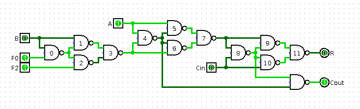

# ALU design

The ALU has to support at least basic logic and arithmetic operations:
- A OR B
- A XOR B
- A AND B
- A ADD B
- A SUB B
- B

There might be also some rotate or shift instructions, we'll deal with them later.

The most basic adder is made by chaining full adders together. Googling for a circuit schematic
we can find common 9-NAND design, which calculates the sum using two 4-NAND XORs and reuses
their internal wiring with one more NAND to get `Cout` signal. Since we want to support subtraction
as well, we have to allow inverting the `B` signal. This is equivalent to adding extra
`invertB` control signal and xoring it with `B`, using another 4 NAND gates:

Here, I split `invertB` into two separate signals, `F0` and `F2`. This doesn't add any transistors,
just an extra I/O port.

Now, how can we add the other needed functions? One way is to add extra control signal to each
NAND gate (making them 3-input each). We may prune most of them later, but let's see if that is
even enough. I wrote a simple simulator that for each combination of control signals outputs
what is the resulting function (`helpers/sim.cpp`).

It turns out we can achieve all of the functions we need (and some extra) using just 
`F0`, `F2`, `F4`, `F6`, `F8` and `F10`, with the last two always being equal:

| Fun | F0 (W) | F2 (X) | F4 (Y) | F6 (Z) | F8 = F10 (MODE) |
|-----|----|----|----|----|----------|
|  OR | 0  | 0  | 0  | 1  | 0        |
| XOR | 0  | 0  | 1  | 1  | 0        |
| AND | 1  | 1  | 1  | 0  | 0        |
|   B | 0  | 0  | 0  | 0  | 0        |
| ADD | 0  | 0  | 1  | 1  | 1        |
| SUB | 1  | 1  | 1  | 1  | 1        |
| CLR | 0  | 1  | 1  | 0  | 0        |
| SET | 0  | 1  | 0  | 1  | 0        |

There's also possibility of getting NOR, XNOR and several implications, but they are uncommon enough
that they will be left unimplemented (they would increase number of control signals). I added CLR
and SET though, since one of them may be useful during further multiplexing phase.

We can further notice that `F8/F10` signal joins the same connections as `Cin`; in other words, if `F8/F10`
is set to 0, carry signal doesn't count. ALU can therefore operate in just bitwise mode - incidentally,
old ALU chip, 74181, also has `MODE` input that switches between arithmetic and logic operations. For this reason
I decided to call this input `MODE` as well. The same signal may be also reused as "save carry" signal -
bitwise operations typically don't update the carry flag. The other control signals don't have a simple
interpretation, so I call them just `W`, `X`, `Y`, `Z`.
