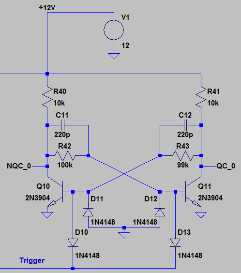

# Clock

The whole CPU will use a single master clock. Each instruction will take two cycles, to accomodate
for some instructions that use immediate value. To ensure correct start, some kind of power-on reset
is required to ignore first cycle or two.

The clock will be generated using astable oscillator, at frequency adjustable in some narrow
range (less than a factor of five or so) by potentiometer. There will be a long chain of
prescaler units, each dividing frequency by two. The actual number of prescalers used will be
decided by DIP switches. There should be also possibility of using external clock, or even
manual button pressing (filtered to avoid glitches) as clock.

The oscillator frequency should be something very large, 10MHz perhaps. The last stage of
prescalers should go down to maybe 0.5Hz, to see the updates in real time. This totals
in about 24 T flip-flops.

[This](http://ch00ftech.com/2012/07/10/transistor-clock-part-2-prescaler/)
design of prescaler seems to be commonly used, and is relatively low on components
(one alternative is using D-flip-flop, which has 6 NANDs):

