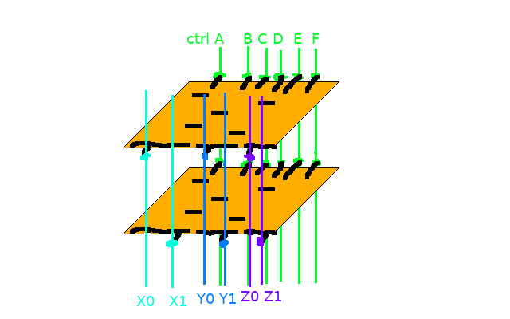

# Components

There are a couple of components repeatedly used in this CPU, such as registers and multiplexers. They can
have unified design to simplify production. Note: for bootstrapping, initially most components can be replaced
with a microcontroller or a ROM chip.

## Registers

This schematic found [here](http://www.play-hookey.com/digital/alt_flip_flops/d_nand_flip-flop.html) looks
good on the first sight.

It has a total of 6 NANDs, all of which are 2-input except for one 3-input. In TTL, that gives us
12 resistors and 19 transistors; in Schottky DTL - 6 transistors, 6 resistors and 13 diodes.

There is a pretty good criticism of this style of registers [here](http://www.megaprocessor.com/GBU_flip_flops.html).
In short, they are prone to data race - say we want to make a T flip flop from D by connecting negative
output to the input. Then, when output switches, input immediately changes too, possibly violating
hold times constraints. I think this issue persists even in proposed master-slave flip-flop
though (unless the two clocks are separated by a margin). I simulated shift register using this flip-flop in LTspice
(.asc file in ltspice directory), and it seems to work excellent. In fact, I checked how short of a
hold time is required, and from simulation it looks like less than 1ns. Perhaps simulation idealizes
it a bit, but still, the propagation delays will likely make the hold time long enough. I tried
feeding negated output as data input and clocking it - i.e. make it a T flip-flop - and at
1kHz it worked excellent. I haven't found any glitches on the scope, and the rise/fall times
were on the order of 100-200ns with 5.1k resistors.

There is one pretty serious issue with this kind of flip-flop though: as far as I can tell, there is
no easy way to add "don't write" signal (i.e. ignore clock rising edge while "don't write" is high).
You cannot just AND clock line with "write", since the rising edge will still appear upon releasing
"don't write" back to high.
The obvious, but pretty large solution is to add another multiplexer before the register,
loading either `D`, or `Q` depending on `write`.

## Multiplexers

Since we represent high signal as pullup or lack of strong low signal, we can use simple connection
as wired-AND gate.

The output of the 2-bit decoder on the schematic acts as an enable signal on each of the inputs.
It would be better to design a "8-bit inverted buffer", i.e. 8 NANDs with one of the
inputs joined together as enables signal; and a 8-bit inverter on the right.

Inverted buffer would have 8 2-input NANDs, i.e. 8 transistors, 8 resistors and 16 diodes;
8-bit inverter - 8 1-input NANDs, i.e. 8 transistors, 8 resistors and 8 diodes.

There's a trick way to save the inverter on register store multiplexers: simply invert logic
of registers (skip inverter before register, thus feeding inverted value; but use negated output
of register in place of normal. Keep in mind asynchronous set/reset have to be changed too though).

## Connections

We will use many boards, and most of them will be bit slices of higher-level components - for example,
8-bit register will consist of 8 smaller boards. It seems like a good idea to have a common way of connecting
boards to main one. I lean towards making a "backplane" of sorts, a main master board of the component,
with several sockets to which slices will be perpendicularly plugged.
I thought about using [round holes goldpins](https://www.google.pl/search?q=round+pin+headers&client=ubuntu&hs=9Sv&source=lnms&tbm=isch&sa=X&ved=0ahUKEwii2LSO69bdAhVCXiwKHWYOBL84ChD8BQgOKAE&biw=1920&bih=945), since they generally make better connections in my experience,
but they don't seem to have bent versions and square ones don't fit to round sockets. I guess
I'll stay with usual rectangular then, hoping for best.

There may be quite a bit of signals coming in and out of components - for example, ALU will have
2 8-bit inputs, 8-bit output, a bunch of control signals and power supply, totalling to around 30-35
wires. That's probably too much to fit on a single board, so the slices will be sandwiched from both
sides, one side dedicated to 8-bit signals, and the other to the smaller ones. Here's a quick
sketch of what it could look like:

For clarity, backplane (and frontplane, if I may call it that) are transparent on the image. All
individual boards (two on the image) are identical in all regards, except for location of 8-bit
interface pin. Note that single pin may be mechanically unstable in regard to twisting stress, so
I'll probably use double pins for each signal (this may also contribute to better contact).

Note that you could make the boards fully identical, including 8-bit pin location, if you translate
the boards relative to the rest of the stack. This will make the stack slanted though. Also, instead
of backplanes you could use long female pin headers for connection (Arduino-shield-like) - though
to avoid shorts you would have to remove a whole copper strip, which is too annoying to be practical.

As for interconnecting components (register to multiplexer, etc.), I think I'll use IDC plugs. There
will be a few "buses" with multiple components connecting to it - using IDC cable we can mount plugs
even in the middle, not just at the ends.
