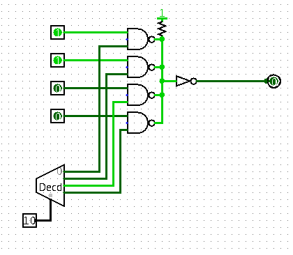

# Components

There are a couple of components repeatedly used in this CPU, such as registers and multiplexers. They can
have unified design to simplify production.

## Registers

This schematic found [here](http://www.play-hookey.com/digital/alt_flip_flops/d_nand_flip-flop.html) looks
good on the first sight.

It has a total of 6 NANDs, all of which are 2-input except for one 3-input. In TTL, that gives us
12 resistors and 19 transistors; in my version of DTL - 6 transistors, 12 resistors and 32 diodes.

There is a pretty good criticism of this style of registers [here](http://www.megaprocessor.com/GBU_flip_flops.html).
In short, they are prone to data race - say we want to make a T flip flop from D by connecting negative
output to the input. Then, when output switches, input immediately changes too, possibly violating
hold times constraints. I think this issue persists even in proposed master-slave flip-flop
though (perhaps to a lesser degree). I simulated shift register using this flip-flop in LTspice
(.asc file in ltspice directory), and it seems to work excellent. In fact, I checked how short of a
hold time is required, and from simulation it looks like less than 1ns. Perhaps simulation idealizes
it a bit, but still, the propagation delays will likely make the hold time long enough.

There is one pretty serious issue with this kind of flip-flop though: as far as I can tell, there is
no easy way to add "don't write" signal (i.e. ignore clock rising edge while "don't write" is high).
You cannot just AND clock line with "write", since the rising edge will still appear upon releasing
"don't write" back to high.
The obvious, but pretty large solution is to add another multiplexer before the register,
loading either `D`, or `Q` depending on `write`.

## Multiplexers

Since we represent high signal as pullup or lack of strong low signal, we can use simple connection
as wired-AND gate.

The output of the 2-bit decoder on the schematic acts as an enable signal on each of the inputs.
It would be better to design a "8-bit inverted buffer", i.e. 8 NANDs with one of the
inputs joined together as enables signal; and a 8-bit inverter on the right.

Inverted buffer would have 8 2-input NANDs, i.e. 8 transistors, 16 resistors and 40 diodes;
8-bit inverter - 8 1-input NANDs, i.e. 8 transistors, 16 resistors and 24 diodes.

## Connections

We will use many boards, and most of them will be bit slices of higher-level components - for example,
8-bit register will consist of 8 smaller boards. It seems like a good idea to have a common way of connecting
boards to main one - right now, I'm considering simple goldpins. In my experience,
they occasionally break contact, and I really don't want that, I've heard good words about
those with [round holes](https://www.google.pl/search?q=round+pin+headers&client=ubuntu&hs=9Sv&source=lnms&tbm=isch&sa=X&ved=0ahUKEwii2LSO69bdAhVCXiwKHWYOBL84ChD8BQgOKAE&biw=1920&bih=945) though.

As for interconnecting components (register to multiplexer, etc.), I think I'll use IDC plugs.
