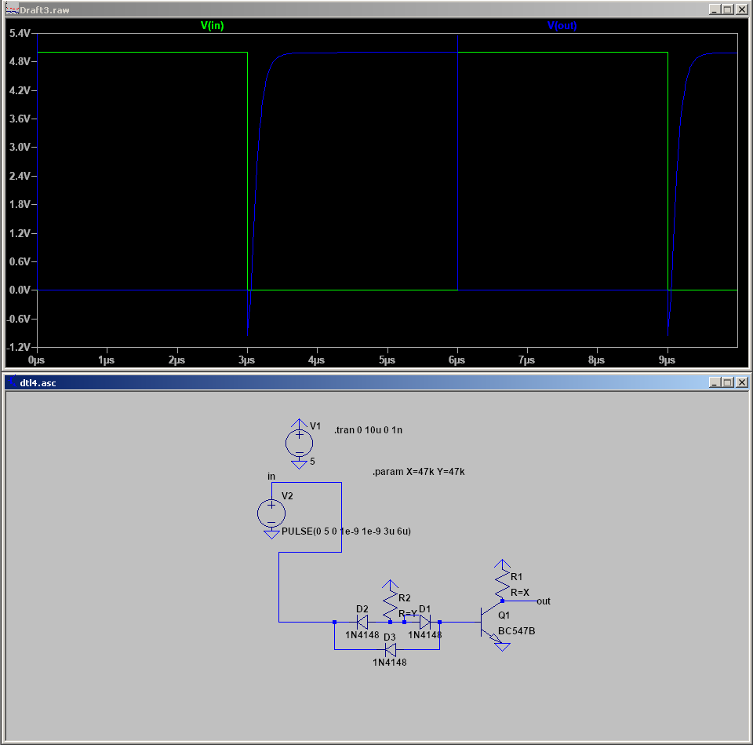
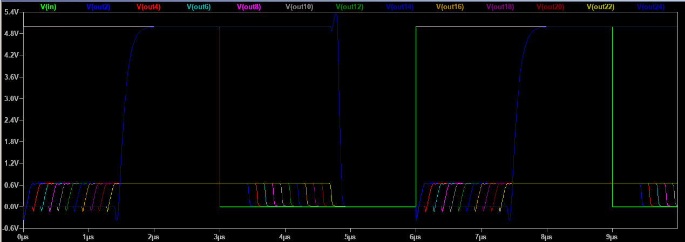
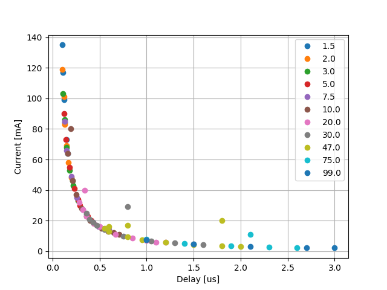
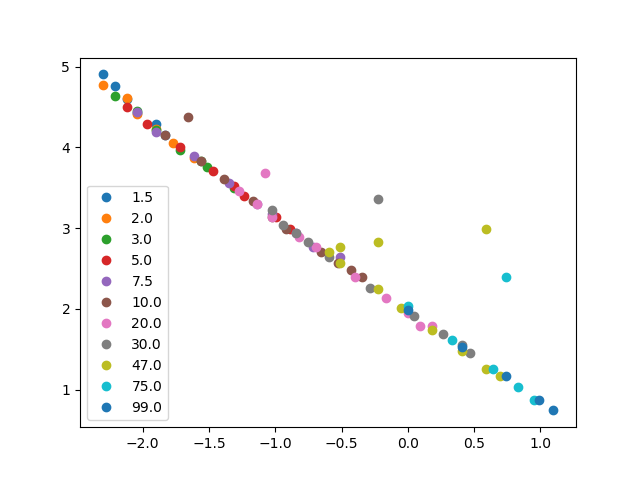

# DTL vs TTL

One of the major decisions to make was what kind of technology to use for basic gates. There are a few
general families of gates:
- DL - Diode Logic
- RTL - Resistor-Transistor Logic
- DTL - Diode-Transistor Logic
- TTL - Transistor-Transistor Logic

Diode logic can be eliminated from the start, since it only allows OR and AND (no inverting capabilities),
and cannot amplify signal. RTL, while being simple, connects inputs together through resistors, which
bleeds voltage back. There are also fundamental limitations with speed, so they were rejected too. In 
the end, we're left with just two options: DTL and TTL.

## DTL

There are at least two subtypes of DTL: the simpler one, which is just DL with extra transistor
acting as inverter and amplifier; and a more complicated one, which uses different diode configuration.
To keep things simple, I will use inverters instead of NANDs or NORs - here are the schematics along
with their simulations:

Top two schematics are the usual ones you can find on the internet, but as you can see, they
have terrible rise times (for used 47k resistor, that's ~50us). This is due to Miller effect,
which, in short, makes transistor capacitance levels worse by a factor of beta (amplification).
See [this question](https://electronics.stackexchange.com/questions/378707/why-is-bjt-nand-rise-time-so-high)
I asked on Stack Overflow for some details.

The third schematic is my attempt to mitigate the situation by introducing extra backwards diode D3.
This helped a lot, but there's still asymmetry between rise (3us) and fall (0.3us).

### Improvement

The circuit above was inspired by Wikipedia's, but the base resistor is not needed - in fact, it 
contributes to most of the slowdown. Here's schematic and simulation without it (note changed
timescale):

The exact measurements will follow after TTL description to compare the two.

## TTL

More modern alternative is TTL, which exchanges the strange-looking two diode configuration
of DTL into a transistor:

The top schematic shows a single TTL inverter, which also has asymmetric rise/fall, but the worse
one is still only 0.4us - much better than DTL. The middle schematic shows effects of joining
three of them in series - somehow, the delay didn't change too much and is still around 0.5us
even in case of two inverters undercoming the worse transition.

We can save on some resistors though if we are only interested in final result and not the
intermediate - we can get rid of R2 and R4. This is equivalent to saying we don't use low and
high voltage as our states, but low voltage or high impedance instead. This somewhat increases
propagation time though (to around 0.6us).

After stringing together 24 of similar inverters, we can see there is a large delay only
after the first one, the other seem to switch much faster:

The most significant difference between the first one and the others is value of high voltage,
which is 5V for the first and roughly 0.7V for the rest. After reducing input voltage
accordingly we see that the initial delay decreased. This does not mean we should decrease
power supply voltage though, just the signal voltage.

The full delay of 24 inverters totals to 1.6us, or roughly 65ns per switch; removing the 
pullups increases this to 3.2us, or 130us per switch.

## Resistors

There's also the matter of resistor values. In TTL, there are two types of resistors, which on 
the schematic are shown near the left transistor or the right one. On the bottom of the page
I included table which for wide variation of these two resistances, states simulated delay
and current consumption.

Here's their plot:

It's a remarkably smooth line, given that we varied both resistor values. In fact, a log-log
graph is a straight line:

The coefficient of the line is roughly -1.2, meaning `delay ^ 1.2 * current` should be about constant.
The fact that the plot is smooth and consistent across wide range of resistors means we should
be able to pick any point on the line even if we use just one kind of resistor (2x47k, 2x4.7k, etc.),
which simplifies things a bit.

Finally, there was also the idea of abandoning the pullup resistor altogether, and use just the
left one. This is equivalent to setting the right resistor's value to gigaohms and thus follow the
same curve. In fact, the results are indistinguishable from the two-resistor ones; and since
they use less components, they seem to be superior.

After searching the internet for this linear relationship, I stumbled upon
[power-delay product](https://en.wikipedia.org/wiki/Power%E2%80%93delay_product),
which is amount of energy to switch state. Apparently for TTL this is about 100pJ in 
common scenarios. Let's see what we get - a middle point on our curve is 0.72us and
9.6mA, both per 24 gates. Per 1 gate, that's 0.03us and 0.4mA respectively. After
multiplying them, we get 0.012nC. Our power supply was 5V, so we multiply by that and
get 0.06nJ, or 60pJ. That's actually even less than expected! Perhaps our methodology
was a bit different or LTspice simulation is imperfect, but it's nice to see we're
in the good ballpark.

## Update ad. one resistor

It seems we cannot use just a single resistor (the one on the left). The gate on its own would work
okay, but when used as NAND with at least two inputs, there is slight leakage of voltage between
the inputs - see [simulation](https://tinyurl.com/y7euyeav). When using no pullup resistor at all,
that meant that a single low input would infect other inputs with low voltage - and they could be
used elsewhere, and would otherwise be high/floating. With the pullup, the "infection" would still
happen, but it would not be enough to cause trouble, since the leaking voltage has quite high impedance
(on the order of base resistor value I think, though LTspice simulation shows about 4 times that).

# Verdict

TODO:rewrite

DTL uses 2R, 3D and 1T per inverter and has ~3us rise time. TTL uses 2R and 2T per inverter
and has rise on the order of 1us, precise value depending on actual resistor choice. TTL seems
like a better choice here. 

I tried to recreate the results outside simulator, by soldering
3 inverters, and they seem to work fine. I measure about 1us of delay on those 3 gates, which
is considerably more than simulated. I blame the oscilloscope though - first, it adds
non-negligible capacitance (15pF * 47kOhm = 0.7us), and second, I'm using its calibration signal
generator as input due to lack of good waveform generator. It seems to have about 2us
rise time, which may distort my measurements too.

# Table of measurements (TTL)

| X \[kohm\] | Y \[kohm\] | Delay of 24 gates \[us\] | Current consumption of 24 gates \[mA\] |
| ------------- | ------------- | ------------- | ------------- |
|-|75  |4.4  |1.3|
|-|50  |3.0  |2.0|
|-|30  |1.9  |3.2|
|-|20  |1.3  |4.8|
|-|15  |1.1  |6.5|
|-|10  |0.72 |9.6|
|-|8   |0.61 |12|
|-|7   |0.54 |14|
|-|6   |0.47 |16|
|-|5   |0.41 |19|
|-|4   |0.34 |24|
|-|3   |0.27 |32|
|-|2   |0.19 |47|
|-|1.5 |0.16 |63|
|-|1   |0.12 |94|
|99.0|99.0|3.0|2.1|
|99.0|75.0|2.7|2.4|
|99.0|50.0|2.1|3.2|
|99.0|30.0|1.5|4.6|
|99.0|17.0|1.0|7.3|
|75.0|99.0|2.6|2.4|
|75.0|75.0|2.3|2.8|
|75.0|50.0|1.9|3.5|
|75.0|30.0|1.4|5.0|
|75.0|17.0|1.0|7.7|
|75.0|10.0|2.1|11.0|
|47.0|99.0|2.0|3.2|
|47.0|75.0|1.8|3.5|
|47.0|47.0|1.5|4.4|
|47.0|30.0|1.2|5.7|
|47.0|20.0|0.95|7.5|
|47.0|15.0|0.8|9.4|
|47.0|10.0|0.6|13.0|
|47.0|8.5|0.55|15.0|
|47.0|7.5|0.6|16.0|
|47.0|7.0|0.8|17.0|
|47.0|5.0|1.8|20.0|
|30.0|99.0|1.6|4.3|
|30.0|75.0|1.5|4.7|
|30.0|50.0|1.3|5.4|
|30.0|30.0|1.05|6.8|
|30.0|17.0|0.75|9.6|
|30.0|10.0|0.55|14.0|
|30.0|8.0|0.47|17.0|
|30.0|7.0|0.43|19.0|
|30.0|6.0|0.39|21.0|
|30.0|5.0|0.36|25.0|
|30.0|4.0|0.8|29.0|
|20.0|99.0|1.2|6.0|
|20.0|75.0|1.1|6.0|
|20.0|50.0|1.0|7.0|
|20.0|30.0|0.85|8.5|
|20.0|17.0|0.67|11.0|
|20.0|10.0|0.5|16.0|
|20.0|8.0|0.44|18.0|
|20.0|6.0|0.36|23.0|
|20.0|5.0|0.32|27.0|
|20.0|4.0|0.28|32.0|
|20.0|3.0|0.34|40.0|
|10.0|99.0|0.71|11.0|
|10.0|50.0|0.65|12.0|
|10.0|30.0|0.59|13.0|
|10.0|20.0|0.52|15.0|
|10.0|10.0|0.4|20.0|
|10.0|8.0|0.36|23.0|
|10.0|6.0|0.31|28.0|
|10.0|4.0|0.25|37.0|
|10.0|3.0|0.21|46.0|
|10.0|2.0|0.16|64.0|
|10.0|1.5|0.19|80.0|
|7.5|99.0|0.6|14.0|
|7.5|30.0|0.49|16.0|
|7.5|17.0|0.43|19.0|
|7.5|10.0|0.36|24.0|
|7.5|7.5|0.32|27.0|
|7.5|5.0|0.26|35.0|
|7.5|3.0|0.2|49.0|
|7.5|2.0|0.15|66.0|
|7.5|1.5|0.13|85.0|
|5.0|99.0|0.41|20.0|
|5.0|30.0|0.37|23.0|
|5.0|10.0|0.29|30.0|
|5.0|7.5|0.27|34.0|
|5.0|5.0|0.23|41.0|
|5.0|3.0|0.18|55.0|
|5.0|2.0|0.14|73.0|
|5.0|1.5|0.12|90.0|
|3.0|99.0|0.27|33.0|
|3.0|10.0|0.22|43.0|
|3.0|7.5|0.21|46.0|
|3.0|5.0|0.18|53.0|
|3.0|3.0|0.15|68.0|
|3.0|2.0|0.13|86.0|
|3.0|1.5|0.11|103.0|
|2.0|99.0|0.2|48.0|
|2.0|10.0|0.17|58.0|
|2.0|5.0|0.15|69.0|
|2.0|3.0|0.13|83.0|
|2.0|2.0|0.12|101.0|
|2.0|1.5|0.1|119.0|
|1.5|99.0|0.16|64.0|
|1.5|10.0|0.15|73.0|
|1.5|5.0|0.13|84.0|
|1.5|3.0|0.12|99.0|
|1.5|2.0|0.11|117.0|
|1.5|1.5|0.1|135.0|

