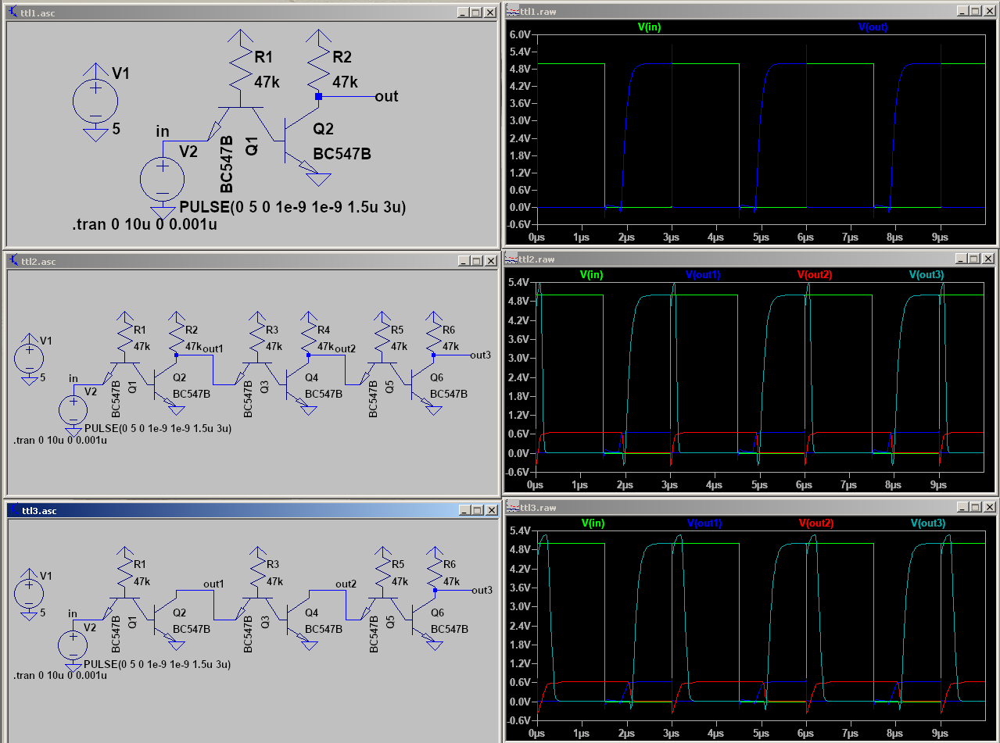

# DTL vs TTL

One of the major decisions to make was what kind of technology to use for basic gates. There are a few
general families of gates:
- DL - Diode Logic
- RTL - Resistor-Transistor Logic
- DTL - Diode-Transistor Logic
- TTL - Transistor-Transistor Logic

Diode logic can be eliminated from the start, since it only allows OR and AND (no inverting capabilities),
and cannot amplify signal. RTL, while being simple, connects inputs together through resistors, which
bleeds voltage back. There are also fundamental limitations with speed, so they were rejected too. In 
the end, we're left with just two options: DTL and TTL.

## DTL

There are at least two subtypes of DTL: the simpler one, which is just DL with extra transistor
acting as inverter and amplifier; and a more complicated one, which uses different diode configuration.
To keep things simple, I will use inverters instead of NANDs or NORs - here are the schematics along
with their simulations:

Top two schematics are the usual ones you can find on the internet, but as you can see, they
have terrible rise times (for used 47k resistor, that's ~50us). This is due to Miller effect,
which, in short, makes transistor capacitance levels worse by a factor of beta (amplification).
See [this question](https://electronics.stackexchange.com/questions/378707/why-is-bjt-nand-rise-time-so-high)
I asked on Stack Overflow for some details.

The third schematic is my attempt to mitigate the situation by introducing extra backwards diode D3.
This helped a lot, but there's still asymmetry between rise (3us) and fall (0.3us).

## TTL

More modern alternative is TTL, which exchanges the strange-looking two diode configuration
of DTL into a transistor:

The top schematic shows a single TTL inverter, which also has asymmetric rise/fall, but the worse
one is still only 0.4us - much better than DTL. The middle schematic shows effects of joining
three of them in series - somehow, the delay didn't change too much and is still around 0.5us
even in case of two inverters undercoming the worse transition. TODO check more?

We can save on some resistors though if we are only interested in final result and not the
intermediate - we can get rid of R2 and R4. This is equivalent to saying we don't use low and
high voltage as our states, but low voltage or high impedance instead. This somewhat increases
propagation time though (to around 0.6us).

