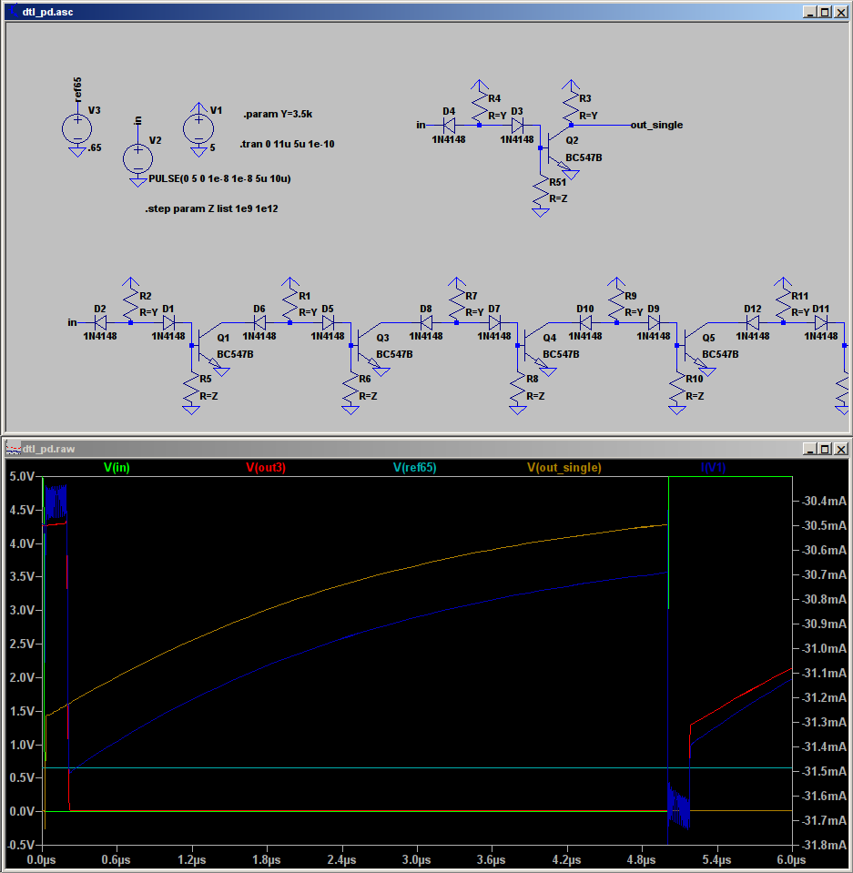
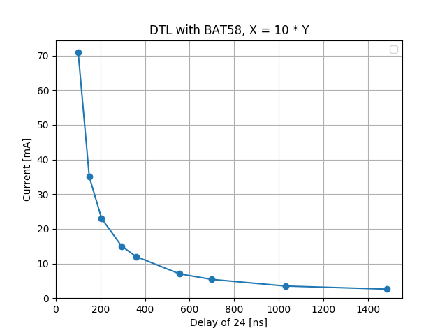

# More about DTL

This is continuation of measurements of very simple logic gates (previously in context of comparison of DTL and
TTL).

## Non-ideal components

After getting very good results in LTSpice and even real circuits using simple Schottky inverters,
I proceeded to build more complex structures, such as D flip-flop. It worked quite oddly, depending
on precise values of resistors used and clock used. After a few hours of bashing my head trying
to figure out why
apparently correct circuit fails to latch in real life, I noticed, in LTSpice, that input signal
slew rates matter a lot. And counter-intuitively, it worked better with more gentle slopes!

Flip-flop has many components and interconnections, so analyzing it just by looking at voltages
and currents vs. time wasn't very helpful. So, I stripped away a lot of things to minimize the
problem to smallest sample behaving in odd way.

## Diode capacitance

The problem was diode capacitance. The following tiny circuit, without even transistor,
shows the problem:

Normally, we would expect the middle point to be almost grounded (through a diode), with its
actual voltage between about 0.2V and 0.7V, depending on which diode is more limiting.
In this case however, we can see that the voltage actually drops below -2V, which should not happen.
It was pretty hard to reliably get this result - in LTSpice I generally set the fall time
to 1ns and disregarded very brief glitches; in real life, the slew rate varied with clock
source I used and how the circuit was loaded, which made the problem hardly reproducible.

The culprit turns out to be Schottky diode relatively high parasitic capacitance - in this
case, roughly 100-200pF. This is two orders of magnitude larger than usual 1N4148 or similar. 
When input falls quickly enough,
the capacitance dominates diode-like behavior. In case of simple inverter chain, as I tested
the design before, this was even beneficial, as it made the given inverter switch before
its input fell below 0.65V - as soon as it started falling with any respectable speed.
In more complex circuits, like aforementioned flip-flops, this caused erratic behavior,
with internal gates glitching. For example, when input quickly falls from 5V to 4.5V for a
moment, then recovers, which is acceptable, the output instead of staying low, creates a short
high pulse during that quick fall moment. In combinational circuitry this could be okay as long
as it is quickly resolved, but in stateful circuits (flip-flops) even a short glitch
is enough for it to switch state.

The same circuit as above, with Schottky switched to 1N4148 and original 1N4148 switched to two
of those, works as expected at all rise times (checked as low as 1ns and noticed almost no capacitance
effects).

Diode capacitance shows also as related problem: that the more inputs the gate has, the slower it
switches, with transition time roughly proportional to fan-in:

I'm pretty sure the reason is the same, and in this case causes the slow resistor to be forced
to charge more than one diode's worth of parasitic capacitance. The time constant
should be: 4k7 ohm * 100pF = 470ns in case of single diode and 5 times that for 5 diodes; LTSpice
simulates both almost an order of magnitude smaller. This may be linked to the fact that we operate
diodes at almost "charged" state, which has unknown to me effects on time constant; or it could
be that we only need to get to 0.7V, not 5V. In any case,
Schottky's seem to be a much less desirable an option now.

## Checking capacitor DTL again

Looks like 13pF is about the best, but if we go too low, there is a sudden rise in delay. Probably
less than that is not enough to fully disable transistor - and sure enough, datasheet for our
transistor quotes 9pF as typical capacitance. LTSpice probably simulates something around that,
so close enough. For safety, we'll go with something a bit higher though, like 22pF or more, which still
has nice timing, but a safety margin too.

## Real circuit

I built another D flip-flop, with this logic used as NANDs. Getting it to stripboard was more
annoying than expected, as I had to find an acceptable gate layout again, and there is one
point/net in the gate that has 5 components, meaning if we just put it flat on stripboard,
a single gate will take at least 6 holes of width (4 gates per 25 column board). That is wasteful,
so I compromised with putting multiple components into one hole. Two diodes make a very tight fit,
so I avoided that whenever possible. I was able to achieve 4 holes width per gate (6 gates per board).
The gate is somewhat wider in the other dimension, so I had one less trace available. Since I won't
use 6 NAND D flip-flops in any way but as frequency dividers, I saved one trace by hardwiring D to /Q.

After soldering and fixing one accidental short, the flip-flop worked. Its performance was less than ideal,
though - I used 4k7 and 22pF as baseline, which simulated as fine divider up to around 10MHz, while
in reality the delay was a couple of microseconds - horrible! I thought it could be the case that the
capacitors were still too small, so I piggybacked a 100nF, way more than necessary, but I wanted to be
on safe side this time. And magically, the delay decreased to 100ns or so, which is close to simulated.

Then I tried to isolate which capacitor caused the problem, by removing 100nF ones one by one - it
turned out two of them were causing delay on falling and rising edge each. I checked how much the
caps had to be to remove the delay, and it seemed that 1nF was enough, but 220pF was on the fence,
with delay noticably smaller but still apparent. I don't know what causes the discrepancy with datasheet
and simulation; maybe the stripboard itself has significant capacitance? Quick Internet search
says its 20-ish pF, non-negligible, though not enough to explain everything.
I restored the two culprits to 100nF and removed the other caps
and tested the circuit on higher frequencies (100s of kHz) and the problem of microsecond delay somehow
returned. Perhaps the parasitic capacitances depend on the frequency so much. Anyway, I fixed 
all the caps back to 100nF and it got good again.

In the end, I was able to achieve stable square wave 2MHz/2=1MHz, while simulation worked up to
about 5MHz/2=2.5MHz. This is pretty close and can be caused by a number of factors, like
oscilloscope effects, imperfect clock signal (it certainly wasn't a perfect square at 2MHz),
perhaps some power supply noise. I'll probably stay on the safe side with using always big capacitors.
I can always decrease resistors (with some penalty in power drain), but debugging high-frequency
problems is a major pain in the ass to be avoided.

## *Pulldown* resistor

The main reason for slowness of vanilla DTL is lack of Ohmic path from base to ground. What if we simply
put a resistor there?

We get a circuit like that. I was in progress of simulating it and finding delay and power in terms of
values of resistors Y and Z, when I noticed a couple of strange things. At first I was holding Y
constant at 5k and varying just Z; it turned out the power stayed almost constant, while delay had
a minimum, at about Z=5k. It rose with both higher and lower Z. So I thought to find such optimal
Z resistor for other values of Y. Everything went well and as expected for Y 5k and larger, but
when I got to the smaller values (3k and less), I noticed there is no clear minimum, instead
delay was decreasing with increasing Z, approaching a certain limit as Z became open circuit.

It seemed almost as though there was no need for Ohmic path if the other resistor was below threshold
of about 3.7k, at which point there is a sudden, almost step-function-like, drop in delay. It seemed
very strange to me, so I modified D flip-flop to use this version of the gate and it actually worked!
I have no explanation for this phenomenon; perhaps again some parasitic stuff is interfering. I'm not
too comfortable relying on such behavior, so I'll stick with the resistor for now. (The no-resistor version
had to be tinkered with when put in a ring oscillator configuration, for example).

I've soldered a 3 inverter ring clock, and it was terrible, frequency around 200kHz. A single inverter
also has delay of around 1us (at input toggling from positive to ground). This is pretty stable and depends
mostly on collector resistor.
Why is there a difference between LTSpice and real circuit?

## Schottky DTL revisited

Remember how I said diode capacitance caused all sorts of problems? Turns out it's 1N5818 that is
weird amongst the Schottkys, and not Schottkys that are weird among the diodes. I looked around
a few electronic catalogues and apparently the pretty cheap BATxx diodes (I chose BAT85S) have
similar characteristics to 1N5818, except for the capacitance ranking - that is 10pF instead of
200pF. When simulated, it has much smaller undershoot (to -0.6V at 5V/ns slope, reduced to about 
-0.15V with more reasonable 5V/10ns slope and 10pF simulated output capacitance). They also
have smaller delay, I'll simulate inverter chain later.
I built another frequency divider with those, seems like they could better (at maybe 3 times
higher frequency at the same current).

Note that there is no BAT85S in LTSpice, only BAT42; but I found some library containing BAT85
model, which I now use.

Speed chart:

### Shared resistors

To reduce amount of soldering I have to do, I generally reuse the base resistors of one gate
as collector resistors of the one driving it. This generally works fine, as the base doesn't take
much current so I can ignore voltage drop from that. The only problem is that When using NAND
of two or more inputs, the resistor is shared between those two inputs, effectively halving
switching speed. One solution is to halve the resistor value in such cases (and reduce to third
in 3-input NANDs). This may take too much current though, if only one input is grounded. The other
solution is to bite the bullet and use two separate resistors per gate - one for base and the other
for collector. This takes more components but is more predictable in terms of current and transition
speed dependence on fan-in and fan-out. (The same issue in reverse happens when one gate drives
two inputs of two other gates, it sees half the resistance and takes twice as much current).
Another problem with resistor reuse is that it doesn't really respect voltage margins - logical
0 is represented as strong pull to 0, so it shows on oscilloscope as 0V, but logical 1 is lack
of that strong pull and possibly some residue pullup from the next gates resistors, which are
at about 1.3V behind a diode at best, so "1" shows as around 0.6V on oscilloscope. This is annoying
and probably not a good idea either. So perhaps I'll return to two resistors, especially that
with BAT85S I should be able to fit it in the same hole I already use (they have thinner leads
than bulky 1N5818).

## Data tables

### Capacitor DTL

| cap \[pF\] | resistor \[kohm\] | Delay of 24 gates \[ns\] | Current consumption of 24 gates \[mA\] |
| ------------- | ------------- | ------------- | ------------- |
|100.0|47.0|1560.0|2.9|
|100.0|30.0|1058.0|4.3|
|100.0|20.0|1020.0|6.0|
|100.0|15.0|920.0|7.9|
|100.0|10.0|640.0|11.3|
|100.0|7.0|480.0|16.0|
|100.0|5.0|350.0|22.0|
|100.0|3.0|235.0|36.0|
|100.0|2.0|170.0|54.0|
|100.0|1.0|105.0|107.0|
|100.0|0.5|75.0|215.0|
|500.0|10.0|700.0|11.3|
|300.0|10.0|685.0|11.3|
|200.0|10.0|670.0|11.3|
|100.0|10.0|640.0|11.3|
|70.0|10.0|615.0|11.3|
|50.0|10.0|580.0|11.3|
|40.0|10.0|540.0|11.3|
|30.0|10.0|500.0|11.3|
|20.0|10.0|415.0|11.5|
|15.0|10.0|360.0|11.8|
|13.0|10.0|340.0|12.0|
|12.0|10.0|340.0|12.0|
|11.0|10.0|380.0|12.3|
|10.0|10.0|700.0|12.2|
|22.0|50.0|1640.0|3.0|
|22.0|30.0|1050.0|4.8|
|22.0|20.0|720.0|6.1|
|22.0|10.0|440.0|11.6|
|22.0|7.0|345.0|16.0|
|22.0|5.0|285.0|22.0|
|22.0|3.0|215.0|37.0|
|22.0|2.0|170.0|55.0|
|22.0|1.0|105.0|110.0|
|22.0|0.5|75.0|215.0|

### BAT85 DTL

| X \[kOhm\] | Y \[kOhm\] | Delay of 24 gates \[ns\] | Current consumption of 24 gates \[mA\] |
| ------------- | ------------- | ------------- | ------------- |
|10.0|1.0|100.0|71.0|
|20.0|2.0|150.0|35.0|
|30.0|3.0|205.0|23.0|
|47.0|4.7|295.0|15.0|
|60.0|6.0|360.0|12.0|
|100.0|10.0|555.0|7.0|
|130.0|13.0|700.0|5.4|
|200.0|20.0|1030.0|3.5|
|300.0|30.0|1485.0|2.6|
