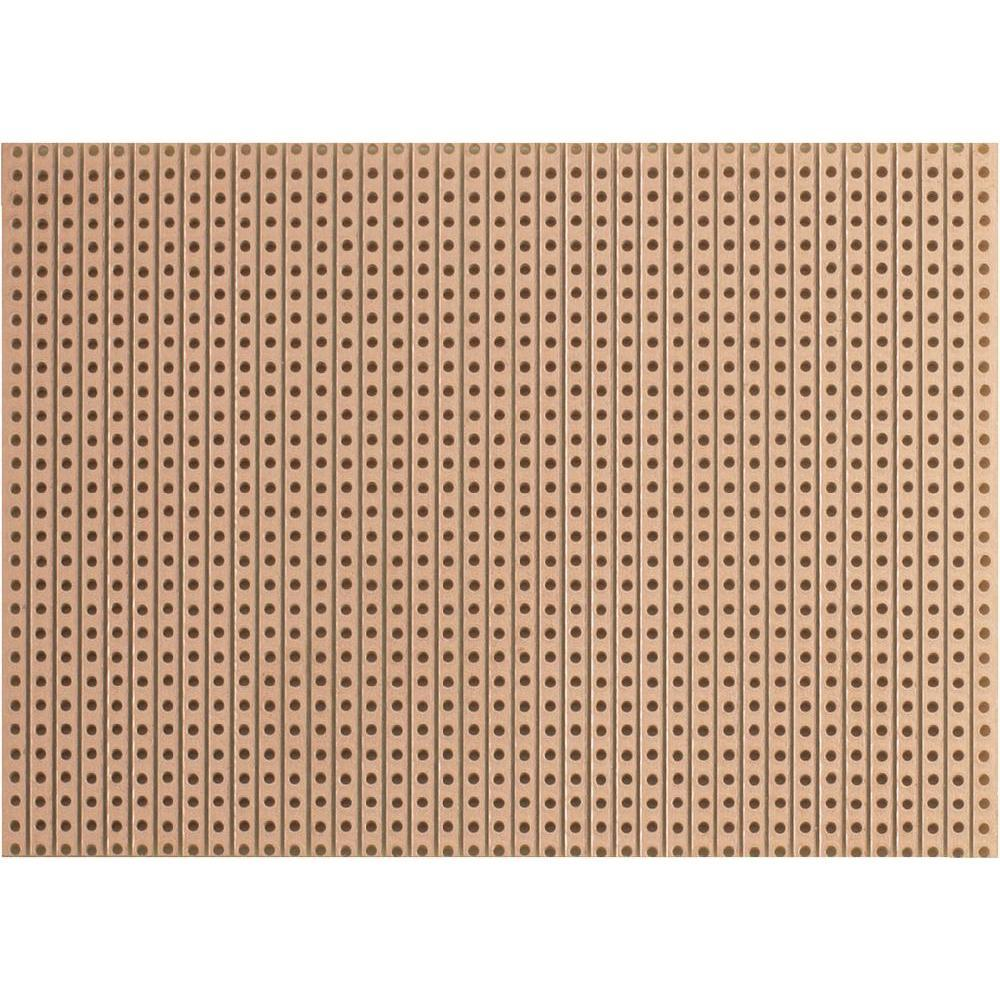

# Layout

Pretty much all of the CPU consists of NAND gates, so it is important to have a good repeatable
layout for them. Each of them needs VCC and GND, so these signals seem useful to have on bus
easily available everywhere. Between gates, there are also more signals, often passing through
quite long distance. For these reasons, I think using a stripboard with long traces is the best
choice here:

