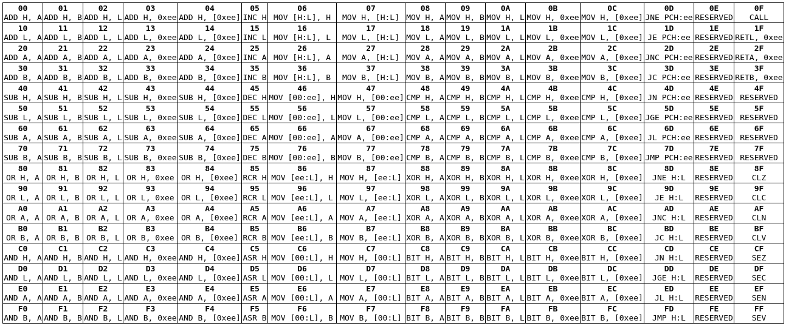

# Opcodes

Opcode map:



## ALU2

```
84218421
--------
aadda000
aadda001
aadda010
aadda011
aadda100
     sss
```

dd - destination register: 00 - H, 01 - L, 10 - A, 11 - B.

aaa - opcode: 000 - ADD, 001 - MOV, 010 - SUB, 011 - CMP, 100 - OR, 101 - XOR, 110 - AND, 111 - BIT.

sss - source: 000 - A, 001 - B, 010 - L, 011 - imm, 100 - @imm.

ADD and SUB always take carry into account, CMP doesn't. CMP and BIT are carryless SUB and AND, except
without storing to destination (flags only). All instructions except MOV store all flags.

## ALU1

```
84218421
--------
aarr0101
```

aa - opcode: 00 - INC, 01 - DEC, 10 - RCR, 11 - ASR.

rr - register: 00 - H, 01 - L, 10 - A, 11 - B.

## Load/store

```
84218421
--------
aarr011s
```

aa - address: 00 - [H:L], 01 - [0:imm], 10 - [imm:L], 11 - [0:L]

rr - register: 00 - H, 01 - L, 10 - A, 11 - B.

s - load/store: 0 - load, 1 - store.

## Jump

```
84218421
--------
accc1101
```

a - address: 0 - [H:L], 1 - [PCH:imm]

ccc - condition: like in MSP430.

## Flags

```
84218421
--------
1sff1111
```

s - clear/set: 0 - clear, 1 - set

ff - flag: TODO order

## Call

```
84218421
--------
00001111
```

(call: PC <- H:L; H:L <- PC+1 - similar to MIPS `jal`)

## Ret imm

```
84218421
--------
00011111
00101111
00111111
  rr
```

(ret imm: PC <- H:L; reg <- imm)

rr - 01: L, 10: A, 11: B.

## Reserved

```
84218421
--------
xxxx1110
01xx1111
```

# Rationale

## Register stores:

Most of these have structure of `X OP Y`, which sets new value of `X` register to `OP(X, Y)`.
There are 4 registers, so they take 4x4 = 16 opcodes each. If H were to be used as source,
instead we use immediate value.
- ADC (add with carry)
- ADD (add without carry) - can be easily emulated, so may be dropped
- SBC (subtract with carry)
- SUB (subtract without carry) - can be easily emulated, so may be dropped
- MOV
- XOR
- OR
- AND
- CMP (same as SUB, but doesn't store)
- BIT (same as AND, but doesn't store)

(total: 16x10 = 160)
(another idea would be to allow src to be [0:imm] as well, but remove ADD and SUB, to get 20x8=160
instructions, or use [0:imm] instead of L as src)

Non-two-register:
- LOAD [H:L]/[0:imm]/[imm:L]/[0:L]
- LPM [H:L] (load program memory; maybe leave this one out, since it complicates 16-bit I-bus)
- SHR/SAR/RCR/ROR (maybe leave rotates out, they are pretty useless)
- INC/DEC
- NOT (XOR 0xFF - useful on its own, and to make NEG using identity `-x == (x ^ 0xff) + 1`)

(total: 4x12 = ~48)

## Memory stores

STR [H:L]/[0:imm]/[imm:L]/[0:L], A/B/imm/L

(total: 4x4 = 16)

## Jumps

Jumps can have destination of `H:L` or `PCH:imm` for local jumps. There will be eight condition
codes, probably the same as MSP430's.

(total: 2x8 = 16)

## Flags

Set/clear C/N/Z/V.

(total: 2x4 = 8)

## Conclusion

As for what is written now, there are 248 possible opcodes, which uses most of opcode space, but
leaves a bit for possible future expansion.

Some of the opcodes may seem redundant (like `AND A, A`), but they can be treated as elaborate NOPs.
For simplicity they are not special cased.
